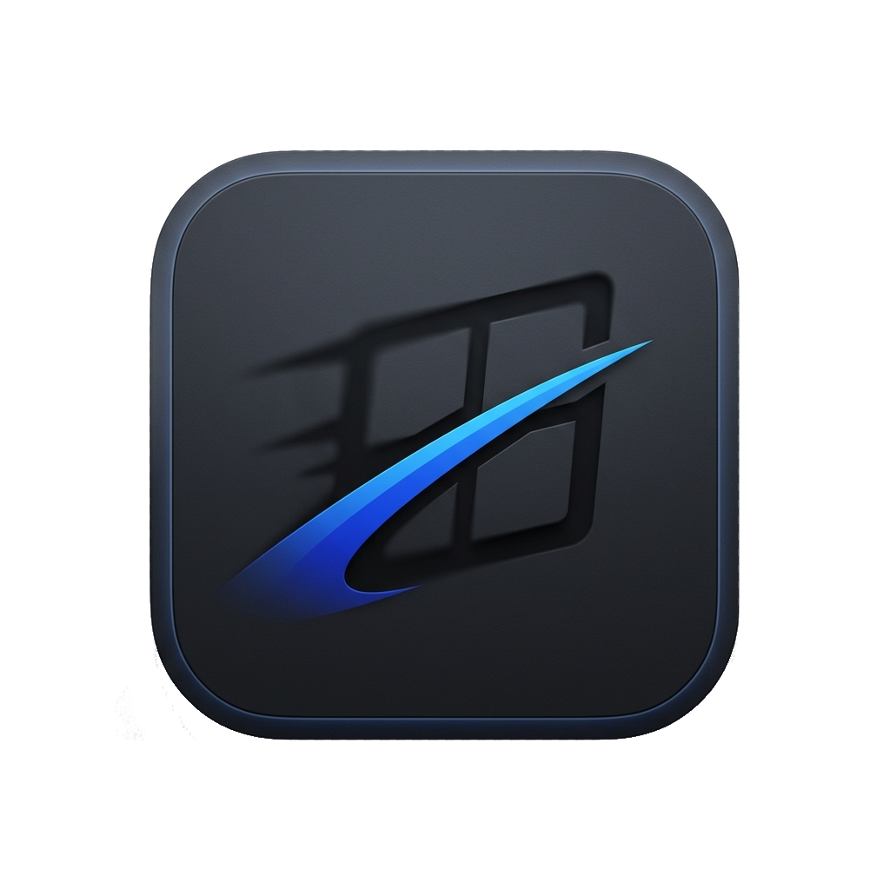
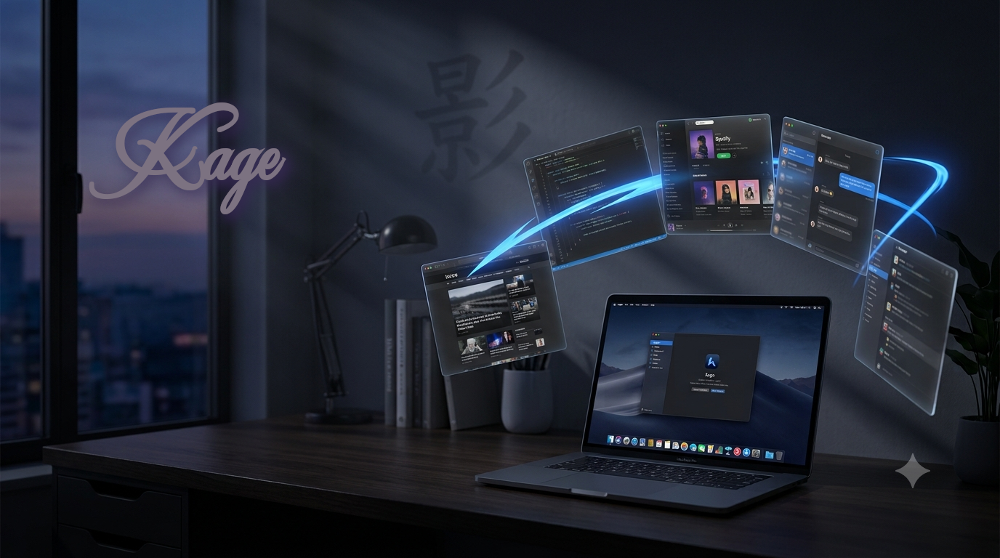

<p align="center">
  
</p>

<h1 align="center">Alt-Tabber</h1>

<p align="center">The window switcher macOS should have shipped with.</p>

---

<p align="center">
  
</p>

macOS's built-in `Cmd+Tab` is a 20-year-old row of blurry icons. It can't show
minimized windows, can't preview what you're switching to, can't let you pick a
*specific* window of an app, and forgets what you used last the moment you log
out. **Alt-Tabber fixes all of it** — and hands you a fuzzy-search launcher in the same
app, with every shortcut rebindable.

* **Option+Tab app switcher** — hold Option, Tab to cycle, release to commit.
  Same gesture you already know, but with **MRU ordering that persists across
  restarts**, live window previews, and Shift+Tab to cycle backward.
* **Option+` per-app window switcher** — cycle just the windows of the app
  you're in and raise the exact one you want. Minimized windows are *not*
  silently hidden the way they are in the stock switcher.
* **Command+A launcher** — a keystroke opens a fuzzy palette of every open
  window *and* every installed app. Type a few letters, hit Enter, and the
  window is raised or the app launched. Open windows rank above apps you
  haven't started yet, and the palette shares the switcher's MRU recency —
  what you raised last ranks first in both.
* **Live previews** — watch a thumbnail of the window you're about to land on,
  or switch to the Window Previews theme where every window is its own
  screenshot tile.
* **Rebind everything** — the Settings window *captures* the actual key combo
  you press, so the binding always works first try. No typos, no guesswork.
  Changes apply instantly — no restart needed.
* **Stays out of your way** — lives quietly in the menu bar, feels instant, and
  **Launch at login** is a checkbox away.

Cross-platform by design: macOS today, Linux (Wayland-first) and Windows next.

## Get started

```sh
uv run alttabber
```

On first launch, grant **Accessibility** and **Screen Recording** permission
when macOS asks, then restart Alt-Tabber. Accessibility lets Alt-Tabber raise and switch
windows; Screen Recording lets it read window titles and show live previews.

## Make it yours

Every shortcut, theme, and behavior lives in the Settings window — no config
files to hand-edit. Pick between the **Default** theme (icons plus a live
preview of your selection) and **Window Previews** (every window shown as its
own thumbnail), choose whether Alt+Tab lists apps or every individual window,
and re-record any hotkey by simply pressing the new combo.

## Tests

The suite uses pytest (install the test extras once):

```sh
uv pip install -e ".[test]"
```

Run the tests (the offscreen Qt platform lets them run headless):

```sh
QT_QPA_PLATFORM=offscreen uv run pytest
```
